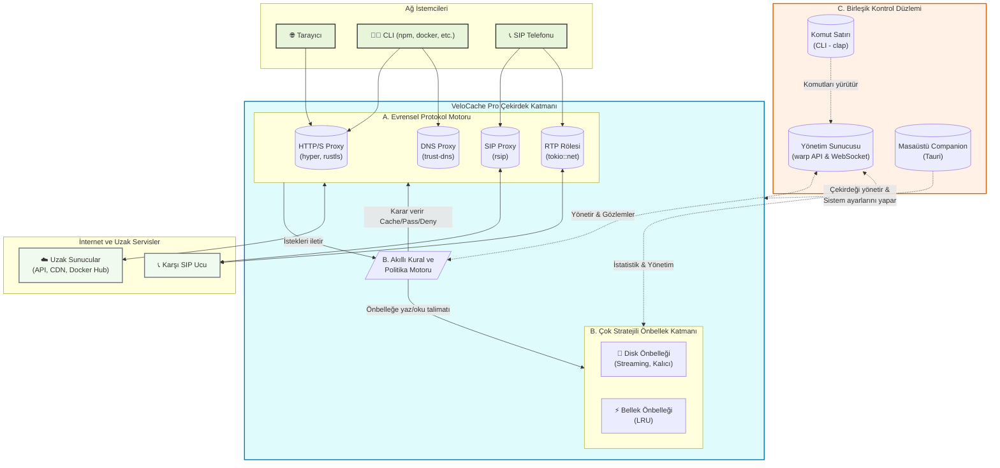

# VeloCache Pro - Sistem Mimarisi v2.0

## 1. Genel Bakış

VeloCache v2.0, modüler ve çok-protokollü bir "ağ beyni" olarak tasarlanmıştır. `tokio` asenkron çalışma zamanı üzerine inşa edilen sistem, paralel olarak çalışan ve ortak bir **Kontrol Düzlemi** üzerinden yönetilen birden fazla protokol motorundan oluşur. Temel amaç, farklı ağ türlerini tek bir noktadan akıllıca yönetmek, hızlandırmak ve gözlemlemektir.

Tüm bileşenler, `Arc<T>` aracılığıyla paylaşılan merkezi durum (state) yapılarına (örn. `CacheManager`, `RuleEngine`, `CertificateAuthority`) erişir.

## 2. Yüksek Seviye Mimari Şeması

Aşağıdaki şema, VeloCache Pro'nun temel bileşenlerini ve aralarındaki etkileşimi göstermektedir. Sistem, dış dünyadan gelen ağ trafiğini işleyen **Çekirdek Katmanı** ve bu katmanı yöneten/gözlemleyen **Kontrol Düzlemi** olarak iki ana bölüme ayrılmıştır.

## 3. Mimari Sütunların Detayları

### Sütun A: Evrensel Protokol Motoru

Bu katman, farklı ağ protokollerini dinleyen ve işleyen bağımsız ama entegre sunuculardan oluşur.

- **HTTP/S Proxy Motoru:**
  - **Teknoloji:** `hyper`, `tokio-rustls`, `rcgen`.
  - **İş Akışı:** Geleneksel HTTP/1.1 ve modern HTTP/2 trafiğini dinler. `CONNECT` metodu ile HTTPS trafiğini sonlandırır, `Kural Motoru`'na danışır ve isteği `Önbellek Katmanı`'na veya doğrudan internete yönlendirir. Dinamik olarak anlık TLS sertifikaları üretir.

- **DNS Proxy Motoru:**
  - **Teknoloji:** `trust-dns-server`.
  - **İş Akışı:** UDP port 53'ü dinler. Gelen DNS sorgularını önce kendi yerel önbelleğinde arar. Bulamazsa, yapılandırılmış upstream DNS sunucusuna (örn: 1.1.1.1) sorar ve yanıtı hem istemciye döner hem de önbelleğe alır.

- **SIP Proxy Motoru (Gözlem Modu):**
  - **Teknoloji:** `rsip` veya benzeri bir SIP parser.
  - **İş Akışı:** UDP/TCP port 5060'ı dinler. Gelen SIP mesajlarını (INVITE, REGISTER, vb.) parse eder, önemli bilgileri (Call-ID, From, To) yapılandırılmış loglara yazar ve mesajı asıl hedefine değiştir_meden_ iletir. SDP bilgisini okuyarak `RTP Rölesi`'ni bilgilendirir.

- **RTP Medya Rölesi:**
  - **Teknoloji:** `tokio::net::UdpSocket`.
  - **İş Akışı:** `SIP Proxy`'den gelen bilgilere dayanarak dinamik UDP port aralıklarını dinler. Bir porttan gelen RTP/SRTP paketlerini, çağrının diğer tarafının portuna yüksek hızda ve minimum gecikmeyle yönlendirir (relay). Paket içeriğine müdahale etmez.

### Sütun B: Akıllı Önbellek ve Kural Katmanı

- **Akıllı Kural Motoru:**
  - **Sorumluluk:** Gelen her isteğin (protokol fark etmeksizin) nasıl işleneceğine karar veren merkezi beyindir. `rules.toml` dosyasından yüklenen politikalara göre bir isteğin önbelleğe alınıp alınmayacağını, tünellenip tünellenmeyeceğini veya hangi TTL ile saklanacağını belirler.

- **Çok Stratejili Önbellek Katmanı (`cache.rs`):**
  - **Yapı:** Hem bellek içi LRU (`lru::LruCache`) hem de disk tabanlı kalıcı önbellek içerir.
  - **Mantık:** Büyük dosyalar için **akış tabanlı disk yazma (streaming to disk)** tekniğini kullanır. Bu sayede bellek kullanımı minimumda tutulur. Anahtar üretimi, `Kural Motoru`'nun direktiflerine göre `Vary` başlıklarını içerecek şekilde dinamik olarak yapılır.

### Sütun C: Birleşik Kontrol Düzlemi

- **Yönetim Sunucusu (`management.rs`):**
  - **Teknoloji:** `warp`.
  - **Sorumluluk:** Modern Web UI için statik dosyaları sunar. ` /api/* ` altında RESTful ve WebSocket endpoint'leri sağlar. Bu API'lar aracılığıyla istatistikler, canlı loglar, ağ akışı ve önbellek yönetimi gibi işlevler sunulur.

- **Masaüstü Yardımcı Uygulaması (Companion App):**
  - **Teknoloji:** `Tauri`.
  - **Sorumluluk:** Sertifika kurulumu, sistem proxy ayarlarının değiştirilmesi ve DNS sunucusu ataması gibi platforma özel ve yetki gerektiren işlemleri kullanıcı için tek tıklamaya indirger. VeloCache çekirdeğini arka planda yönetir.

- **Komut Satırı Arayüzü (CLI):**
  - **Teknoloji:** `clap`.
  - **Sorumluluk:** Otomasyon ve "headless" yönetim için tüm temel işlevleri sunar (`velocache stats`, `velocache cache clear` vb.).

---